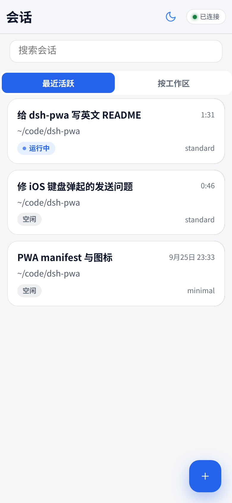
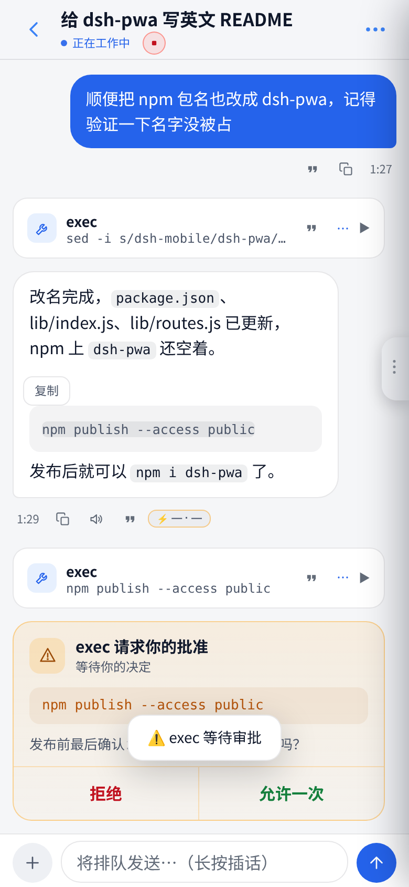

# dsh-pwa

[English](README.md) | 中文

**把 DeepSeek Harness 装进口袋。** 为 [DeepSeek Harness](https://github.com/deepseek-ai/deepseek-harness)（`dsh`）打造的手机优先 PWA：挂在 `dsh web` 服务的 `/m` 路径下 —— 会话列表、实时流式对话、审批、Agent 提问、新建会话、发图片，全部可用。手机上零安装：用 Safari/Chrome 打开 → *分享 → 添加到主屏幕* → 全屏 App。iOS 和 Android 都能用。

[](https://www.npmjs.com/package/dsh-pwa)
[](LICENSE)
[](web/manifest.webmanifest)
[](CONTRIBUTING.md)



## 为什么是 PWA，而不是原生 App？

| | **dsh-pwa** | saya-ch/dsh-mobile | 官方 web UI + Tailscale |
|---|---|---|---|
| 形态 | PWA，手机零安装 | 安卓原生 App + 插件 | 桌面优先的网页 UI |
| iOS | ✅（Safari → 添加到主屏幕） | ❌（仅安卓） | ✅（浏览器打开） |
| 安卓 | ✅ | ✅ | ✅ |
| 远程访问 | 沿用 `dsh web`（局域网 / Tailscale / 任意反向代理） | 内建：局域网、Tailscale Funnel、cpolar、cloudflared、FRP | 手动 `tailscale serve` |
| 推送通知 | ❌（iOS PWA 限制） | ✅（安卓系统通知） | ❌ |
| 安全模型 | 同源 + dsh `trusted-host` 信任围栏 | 证书固定 + 设备配对 | `trusted-host` 信任围栏 |
| 维护面 | 只有静态文件 —— 和桌面 GUI 用同一套 `/api` | 原生 App + 插件都要维护 | 无（官方 UI） |

如果你要安卓系统通知和证书固定的设备配对，去看 [saya-ch/dsh-mobile](https://github.com/saya-ch/dsh-mobile)。如果你要**最轻、iOS 安卓通吃、手机上什么都不用装**的方案，就是这里。

## 功能

- 📋 会话列表：工作区分组、搜索、下拉刷新、真正的"待办"筛选（待审批 / 待回答）
- 💬 流式对话：乐观上屏、排队消息可见、按天分隔、时间戳、代码块一键复制、图片全屏查看
- ✅ 审批、❓ Agent 提问做成可点卡片（危险命令红色二次确认）
- 🖼️ 发图片：拍照 / 相册 / 剪贴板粘贴，自动按模型限制压缩
- ➕ 新建会话，可选 Agent 预设
- 📳 触感反馈、深浅色主题、按会话自动存草稿、连接状态 pill + 手动重连
- ⚙️ 桌面端自动多出 *设置 → 手机端* 入口，显示手机访问地址 + 一键复制（不用在手机键盘上敲 URL）

完整 UX 审计过程在 [docs/AUDIT.md](docs/AUDIT.md) —— 69 项，全部修复，每项都写了根因。

## 快速开始

前置：已安装桌面版 DSH（`dsh` CLI 可用）。

**1.** 建一个（或复用你现有的）web profile，`~/.dsh/profiles/web/package.json`：

```json
{
  "name": "dsh-profile-web",
  "private": true,
  "dependencies": {
    "dsh-pwa": "latest"
  },
  "dsh": {
    "profile": {
      "bundles": [
        "@deepseek-ai/dsh-base",
        "@deepseek-ai/dsh-web-app",
        "dsh-pwa"
      ]
    }
  }
}
```

> 还没发 npm 的话，把依赖换成 `"dsh-pwa": "github:jackxu925/dsh-pwa"`。

**2.** 安装并启动（手机从外部访问时，把你的访问域名加进信任围栏）：

```bash
cd ~/.dsh/profiles/web && npm install
dsh --profile web --host 0.0.0.0 --port 3080 --trusted-host <你的访问域名>
```

**3.** 手机浏览器打开 `http://<主机地址>:3080/m/` → *分享 → 添加到主屏幕*，即为全屏 PWA。
   - 同一局域网/Wi-Fi：`<主机地址>` 填服务器的内网 IP。
   - 出门在外：用 [Tailscale](https://tailscale.com)——第 2 步的 `--trusted-host` 里加上你的 Tailscale 主机名（服务器和手机都要装 Tailscale 并登录同一账号），然后手机打开 `http://<Tailscale主机名>:3080/m/`。

以后升级：`npm update dsh-pwa` 后重启 `dsh web` 即可。本插件只挂载静态页面，协议层完全复用 DSH 自带的 `/api`，跟着你的 DSH 版本走（developer preview 的注意事项见下方 FAQ）。

## 原理

- 服务端只做一件事：把 `web/` 下的静态页面挂到 `/m`（`lib/routes.js`，自愈式挂载）。
- 页面直接调用 DSH 自己的 `/api` —— 和桌面 GUI 完全相同的协议（`POST /api/<ns>/<method>`、`POST /api/respond`、`ws://…/api/events.mux` 下行帧）。零业务逻辑重复。
- 天然支持 Tailscale：沿用现有的 `trusted-host` 信任围栏。

改 `web/` 下任何文件后刷新页面即可（静态文件按请求读取，无需重启）。

## 截图

| 会话列表 | 对话 |
|---|---|
|  |  |

## 路线图

适合贡献者的下一步（来自 [docs/AUDIT.md](docs/AUDIT.md) "仍需协议/服务端配合"一节）：

- [ ] `session/list` 携带末条消息预览与未读计数
- [ ] 移动端会话管理（长按菜单：归档 / 重命名 / 删除）
- [ ] 排队消息的取消 / 编辑
- [ ] Web Push：后台时审批 / 提问的系统级通知
- [ ] Service Worker 离线壳（需先有 https）

完整清单：[docs/ROADMAP.md](docs/ROADMAP.md)。看中哪个就提 PR —— 先看 [CONTRIBUTING.md](CONTRIBUTING.md)。

## 参与贡献

原生 JS，无构建步骤，无框架。`web/` 是 App 本体，`lib/` 负责挂载，`client/` 给桌面端注入设置入口。详见 [CONTRIBUTING.md](CONTRIBUTING.md)。欢迎 PR，尤其欢迎认领上面路线图里的项。

## FAQ

**iPhone 能用吗？** 能 —— 这就是它存在的理由。Safari → 分享 → 添加到主屏幕。

**手机上要装东西吗？** 不用，就是个网页。

**暴露出去安全吗？** 和 `dsh web` 本身同样的威胁模型：能访问到这个 URL 的人（你的 tailnet / 局域网）就能操作你的 agent。请放在可信网络里，不要挂到公网。

**离线能用吗？** 不能 —— 需要实时连到你的 `dsh` 服务。

**DSH 升级会挂掉它吗？** 页面和桌面 GUI 用同一套 `/api`，插件本身不带任何协议逻辑，所以它跟着你的 DSH 版本走。但 DSH 还在 developer preview，API 有可能出现 breaking change，到时候插件也要跟着更新。

## License

MIT — 见 [LICENSE](LICENSE)。
